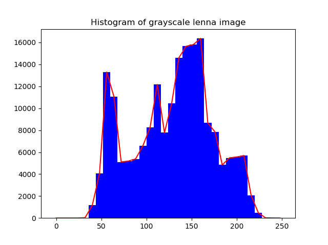
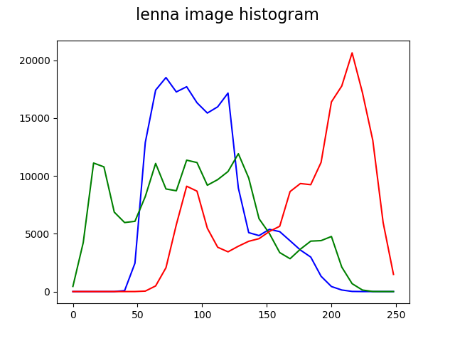
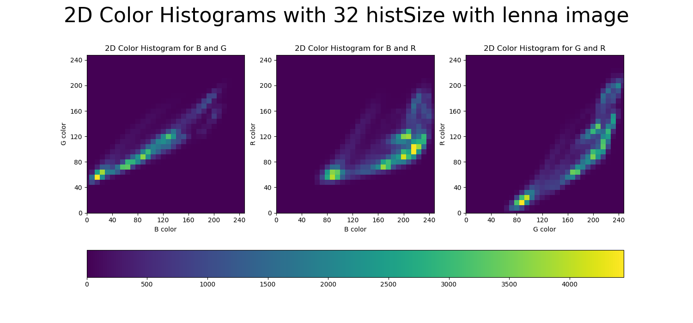
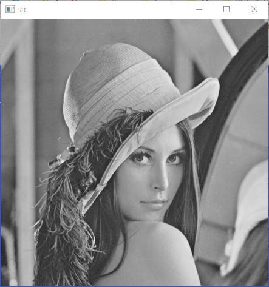
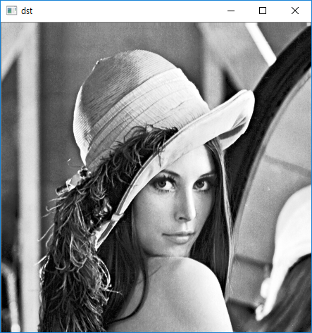
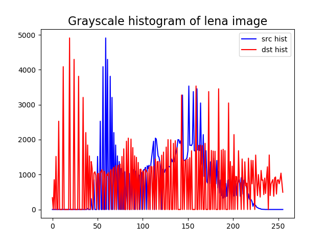
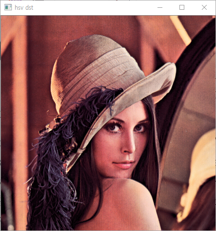
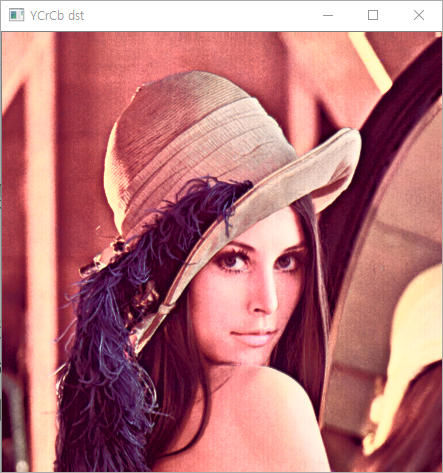

# 이미지의 histogram을  구하는 함수

이미지 픽셀의 분포를 알아보기 위해 히스토그램을 사용할 때 필요한 함수 입니다.

내용은 다음을 참조하시기 바랍니다. <br>
https://gaussian37.github.io/vision-opencv-histogram/

간단하게 실행하려면 아래와 같습니다.

+ histogramGrayscale : 그레이스케일 이미지로 변경 뒤 히스토그램을 구합니다.

```  
python histogramGrayscale.py --image="이미지 파일 경로" --bins=히스토그램사이즈
```



<br>

+ histogramColor : 칼라 이미지의 RGB 값을 비교합니다.

```
python histogramGrayscale.py --image="이미지 파일 경로" --bins=히스토그램사이즈
```



<br>



<br>

+ histogramEqualizationGray : 그레이스케일 이미지의 히스토그램 평활화를 적용합니다.

```
python histogramEqualizationGray.py --image="이미지 파일 경로" 
```

 <br>
 <br>
 <br>

+ histogramEqualizationColor : 컬러 이미지에 히스토그램 평활화를 적용합니다. (HSV, YCbCr의 밝기 부분만 적용하여 컬러값 유지) 

```
python histogramEqualizationColor.py --image="이미지 파일 경로" 
```

 <br>
 <br>