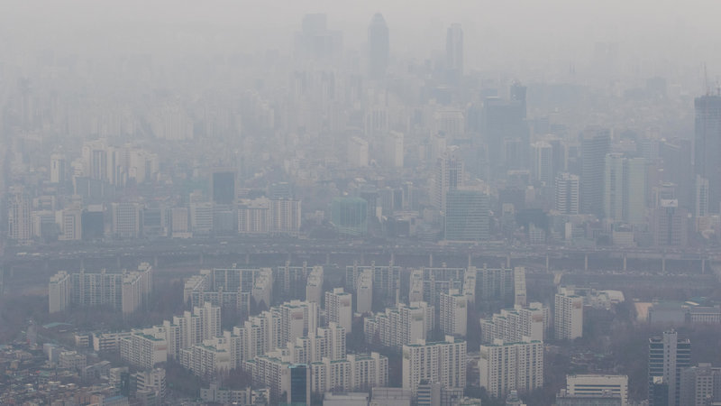
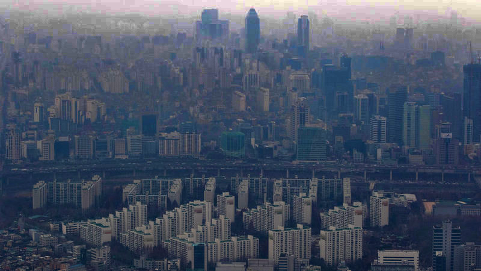

# single image dehaze
## Introduction
This program implement single image dehazing using dark channel prior. 

## Compile Dependencies
- OpenCV
- Numpy

## Examples

## Algorithms
- Single Image Haze Removal Using Dark Channel Prior, Kaiming He, Jian Sun, and Xiaoou Tang", in CVPR 2009 
- Guided Image Filtering, Kaiming He, Jian Sun, and Xiaoou Tang", in ECCV 2010.
